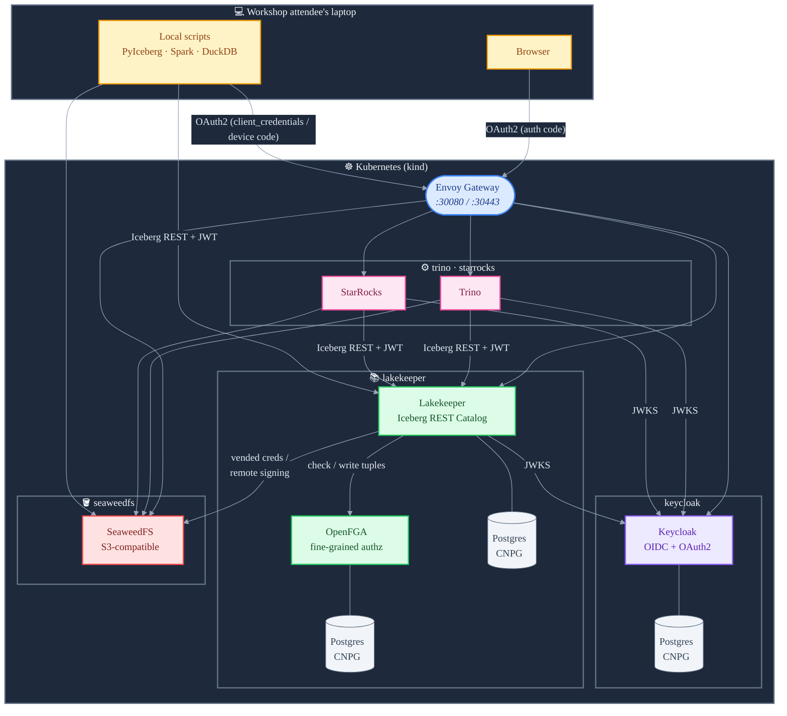

# Building a Secure Open-Source Lakehouse

Hands-on workshop: secure Apache Iceberg tables across multiple query engines using open standards.

You'll learn which OAuth2 flows to use for human and machine users, when to enforce
permissions in the catalog versus the query engine, and how to wire identity providers,
authorization systems, query engines, and the Iceberg REST Catalog together on Kubernetes.

## Architecture



## Components

| Component | Purpose | Namespace |
|-----------|---------|-----------|
| [CloudNativePG](https://cloudnative-pg.io/) | PostgreSQL operator | `cnpg-system` |
| [Sealed Secrets](https://sealed-secrets.netlify.app/) | Encrypt secrets for Git storage | `sealed-secrets` |
| [Envoy Gateway](https://gateway.envoyproxy.io/) | Ingress with TLS termination | `envoy-gateway-system` |
| [SeaweedFS](https://github.com/seaweedfs/seaweedfs) | S3-compatible object storage | `seaweedfs` |
| [Keycloak](https://www.keycloak.org/) | Identity provider (OAuth2) | `keycloak` |
| [Lakekeeper](https://github.com/lakekeeper/lakekeeper) | Iceberg REST Catalog | `lakekeeper` |
| [OpenFGA](https://openfga.dev/) | Authorization system (bundled with Lakekeeper) | `lakekeeper` |
| [Trino](https://trino.io/) | Multi-user query engine | `trino` |
| [StarRocks](https://www.starrocks.io/) | Multi-user query engine | `starrocks` |
| Spark / PyIceberg / DuckDB | Single-user engines (run locally) | — |

## Prerequisites

- Docker (or podman with `KIND_EXPERIMENTAL_PROVIDER=podman`)
- [kind](https://kind.sigs.k8s.io/docs/user/quick-start/#installation)
- [kubectl](https://kubernetes.io/docs/tasks/tools/)
- [Helm](https://helm.sh/docs/intro/install/)
- [uv](https://docs.astral.sh/uv/getting-started/installation/) (Python package manager)
- A JDK (17 or 21) on `PATH` — needed for the Spark scripts. macOS: `brew install openjdk@21`.

Optional but strongly recommended:

- [k9s](https://k9scli.io/) — terminal UI for navigating the cluster, watching pod state, and tailing logs across namespaces.

Optional:

- [kubeseal](https://github.com/bitnami-labs/sealed-secrets/releases) — only if you want to play with the Sealed Secrets controller.

## Quick Start

### 1. Create the kind cluster

```bash
kind create cluster --name lakehouse --config kind-cluster.yaml
```

Patch CoreDNS so that `*.localtest.me` hostnames resolve to the correct in-cluster
services. `*.localtest.me` is a public DNS wildcard that resolves to `127.0.0.1`,
so the same URLs work both inside the cluster (via this CoreDNS rewrite) and on
your laptop (via public DNS → kind port mappings) — no `/etc/hosts` edits needed.

We can't use `*.localhost` here because libc (glibc/musl) special-cases the
`.localhost` TLD per RFC 6761 and short-circuits it to loopback before ever
querying DNS, so the CoreDNS rewrite would be bypassed inside pods.

```bash
kubectl get configmap coredns -n kube-system -o yaml | \
  sed '/rewrite name.*\.localtest\.me/d' | \
  sed 's/ready/rewrite name keycloak.localtest.me keycloak-alias.keycloak.svc.cluster.local\n        rewrite name lakekeeper.localtest.me lakekeeper-alias.lakekeeper.svc.cluster.local\n        rewrite name s3.localtest.me seaweedfs-alias.seaweedfs.svc.cluster.local\n        rewrite name starrocks.localtest.me starrocks-alias.starrocks.svc.cluster.local\n        ready/' | \
  kubectl apply -f -

kubectl rollout restart deployment coredns -n kube-system
```

Verify the rewrite works (once SeaweedFS is deployed):

```bash
kubectl run dns-test --rm -it --restart=Never --image=busybox:1.36 -- nslookup keycloak.localtest.me
```

### Working with namespaces

Throughout this workshop we install each component in its own namespace.
To quickly switch your default namespace, set up this alias:

```bash
alias kns='kubectl config set-context --current --namespace'
_kns() { COMPREPLY=($(compgen -W "$(kubectl get namespaces -o jsonpath='{.items[*].metadata.name}')" -- "${COMP_WORDS[COMP_CWORD]}")); }
complete -F _kns kns
```

Then switch namespaces with:

```bash
kns lakekeeper    # now all kubectl commands target the lakekeeper namespace
kns keycloak      # switch to keycloak
```

You can always check which namespace you're in with:

```bash
kubectl config view --minify --output 'jsonpath={..namespace}'
```

### 2a. Install Core components

Install in order — some steps depend on previous ones.

```bash
# Add upstream Helm repos used by the chart dependencies
helm repo add cloudnative-pg https://cloudnative-pg.github.io/charts
helm repo add sealed-secrets https://bitnami-labs.github.io/sealed-secrets
helm repo add lakekeeper https://lakekeeper.github.io/lakekeeper-charts
helm repo add trino https://trinodb.github.io/charts
helm repo update
```

```bash
# CloudNativePG operator
helm dependency build charts/cloudnative-pg
helm upgrade --install cloudnative-pg charts/cloudnative-pg -n cnpg-system --create-namespace

# Wait for CNPG operator to be ready
kubectl wait --for=condition=Available deployment/cloudnative-pg \
  -n cnpg-system --timeout=120s
```

```bash
# Sealed Secrets controller (optional, for secure secrets in git!)
helm dependency build charts/sealed-secrets
helm upgrade --install sealed-secrets charts/sealed-secrets -n sealed-secrets --create-namespace
```

```bash
# Envoy Gateway (ingress with TLS)
helm dependency build charts/envoy-gateway
helm upgrade --install envoy-gateway charts/envoy-gateway -n envoy-gateway-system --create-namespace
```

```bash
# Object storage
helm upgrade --install seaweedfs charts/seaweedfs -n seaweedfs --create-namespace
```

```bash
# Identity provider
helm upgrade --install keycloak charts/keycloak -n keycloak --create-namespace
```

```bash
# Iceberg REST Catalog (includes OpenFGA for authorization)
helm dependency build charts/lakekeeper
helm upgrade --install lakekeeper charts/lakekeeper -n lakekeeper --create-namespace
```

### 2b. Query Engines

```bash
# trino
helm dependency build charts/trino
helm upgrade --install trino charts/trino -n trino --create-namespace
```

```bash
# starrocks
helm upgrade --install starrocks charts/starrocks -n starrocks --create-namespace
```

Checkpoint — every pod across all namespaces should be `Running` or `Completed`:

```bash
kubectl get pods -A | grep -vE 'Running|Completed'
```

If anything's `CrashLoopBackOff` or `Pending` after a couple of minutes, fix
that before moving on.

### 3. Access the services

All HTTP-facing services are routed via Envoy Gateway. The HTTPS endpoints
use a self-signed certificate (you'll get a browser warning the first time).

| Service | URL | Credentials |
|---------|-----|-------------|
| Keycloak Admin | https://keycloak.localtest.me:30443 | admin / admin |
| Lakekeeper UI | https://lakekeeper.localtest.me:30443 | (via Keycloak OAuth2) |
| Trino | https://trino.localtest.me:30443 | (via Keycloak OAuth2) |
| SeaweedFS S3 | http://s3.localtest.me:30080 | `admin` / `adminadmin` |
| SeaweedFS Filer UI | http://filer.localtest.me:30080 | (no auth) |


### 4. Running scripts locally

The workshop scripts run locally (e.g. in VSCode) outside the cluster and
connect to the services via the `*.localtest.me` URLs above. No `/etc/hosts`
edits are required — `*.localtest.me` resolves to `127.0.0.1` via public DNS,
which the kind port mappings forward into the cluster's Envoy Gateway.

Install dependencies:

```bash
cd scripts
uv sync
source .venv/bin/activate
```

First run the setup scripts in order — they bootstrap Lakekeeper, create the
warehouse, load data, and grant permissions. Every demo script below depends
on this state:

```bash
python 00_setup/01_bootstrap.py     # bootstrap Lakekeeper with the admin client
python 00_setup/02_warehouse.py     # create the 'demo' warehouse
python 00_setup/03_data.py          # create finance.product + finance.revenue
python 00_setup/04_permissions.py   # grant the workshop authz assignments
```

Then run any of the demo scripts:

```bash
python oauth/01_client_credentials.py    # mint a client-credentials token from Keycloak
python oauth/02_device_code.py           # browser-based device-code flow

python trino/01_h2m_browser.py           # human → Trino via browser OAuth
python trino/02_m2m_manual.py            # service → Trino with a manual token
python trino/03_m2m_refresh.py           # service → Trino with token refresh

python starrocks/01_catalog.py           # configure StarRocks Iceberg catalog
python starrocks/02_m2m.py               # service → StarRocks

python vended-credentials/01_load_table.py   # loadTable + scoped S3 creds demo
python vended-credentials/02_remote_sign.py  # S3 remote signing by hand

python pyiceberg/01_m2m.py               # PyIceberg service principal
python pyiceberg/02_h2m_manual.py        # PyIceberg device-code (manual)
python pyiceberg/03_h2m_refresh.py       # PyIceberg device-code with token refresh

python duckdb/m2m.py                     # DuckDB service principal
python duckdb/h2m.py                     # DuckDB device-code (token injected from Python)

python spark/m2m.py                      # Spark service principal (client_credentials)
python spark/h2m.py                      # Spark authorization-code via Dremio's authmgr-oauth2
```

Each script prints what it's doing — open the source to follow along during
the workshop.

#### Switching service principals

The m2m scripts default to `airflow-sp-1` (full warehouse modify). To switch
to `airflow-sp-2` (only `SELECT` on `finance.product`) and watch the authz
gate kick in on `finance.revenue`, set `WORKSHOP_SP`:

```bash
WORKSHOP_SP=airflow-sp-2 python trino/02_m2m_manual.py
WORKSHOP_SP=airflow-sp-2 python pyiceberg/01_m2m.py
```

#### Spark notes

- `scripts/spark/*.py` use `pyspark` from `uv sync` (bundles the Spark
  distribution) plus a JDK 17/21 on `PATH`. The first run downloads Iceberg +
  Dremio AuthManager jars via `--packages`; subsequent runs hit the local Ivy
  cache.
- **`unset SPARK_HOME`** before running. If you have a stale Spark install on
  your shell, pyspark will use *that* one instead of the bundled jars and the
  catalog will fail to load (`'JavaPackage' object is not callable`).

### 5. Teardown

```bash
kind delete cluster --name lakehouse
```

## Repository Structure

```
kind-cluster.yaml          kind cluster config with port mappings
charts/
  cloudnative-pg/          CloudNativePG operator (cnpg-system)
  sealed-secrets/          Bitnami Sealed Secrets controller (sealed-secrets)
  envoy-gateway/           Envoy Gateway + Gateway + TLS (envoy-gateway-system)
  seaweedfs/               SeaweedFS S3-compatible object storage (seaweedfs)
  keycloak/                Keycloak + CNPG Cluster + HTTPRoute (keycloak)
  lakekeeper/              Lakekeeper + OpenFGA + 2x CNPG Cluster + HTTPRoute (lakekeeper)
  trino/                   Trino + Iceberg catalog + HTTPRoute (trino)
  starrocks/               StarRocks all-in-one + Iceberg catalog + HTTPRoute (starrocks)
scripts/
  lib/                     Shared config + auth helpers
  00_setup/                Bootstrap, warehouse, data, permissions (run first)
  oauth/                   Standalone OAuth2 demos (client_credentials, device_code)
  pyiceberg/               PyIceberg m2m + h2m
  trino/                   Trino h2m (browser) + m2m
  starrocks/               StarRocks catalog + m2m
  spark/                   Spark m2m + h2m via Dremio authmgr
  duckdb/                  DuckDB m2m + h2m
  vended-credentials/      loadTable + scoped S3 creds + remote signing demos
```

Each chart is a thin wrapper around an upstream Helm chart (as a dependency), adding
workshop-specific configuration, CNPG-managed PostgreSQL clusters, and Gateway API
routing where needed.
